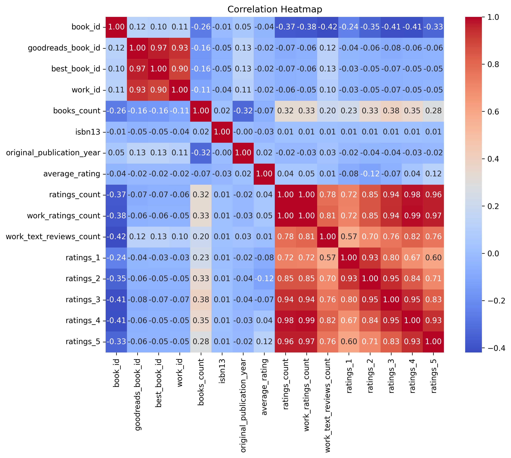
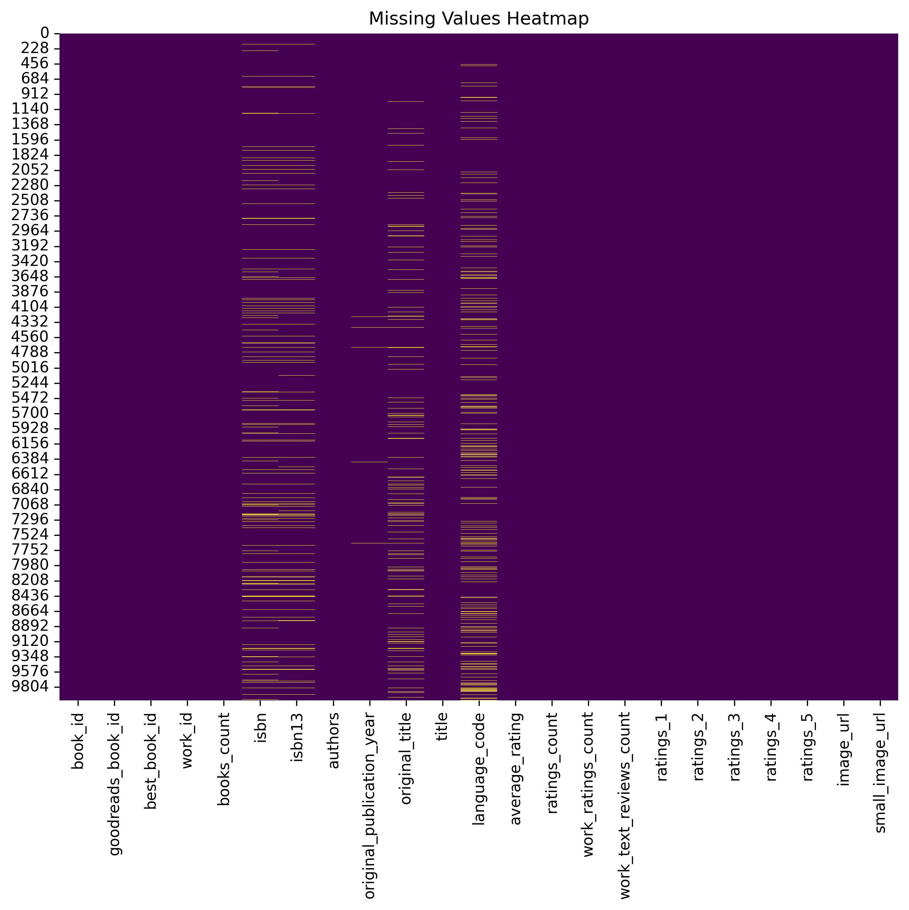
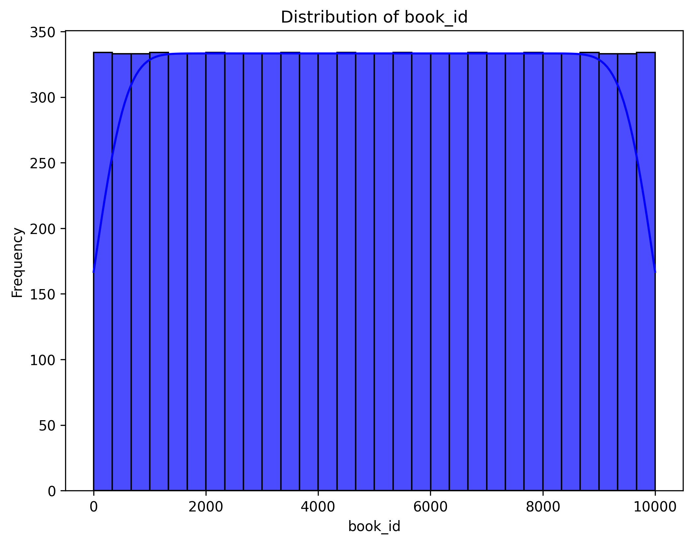
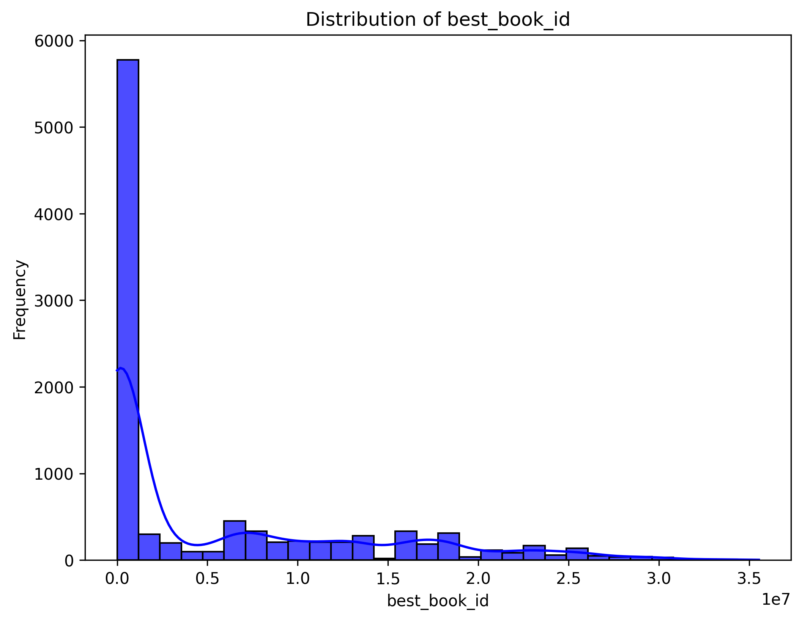
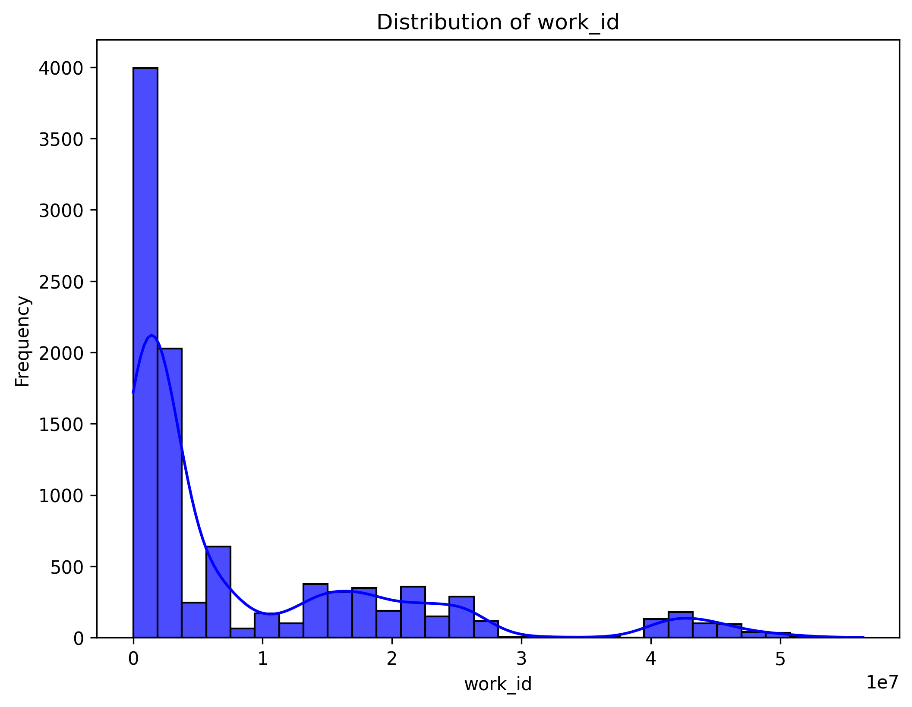
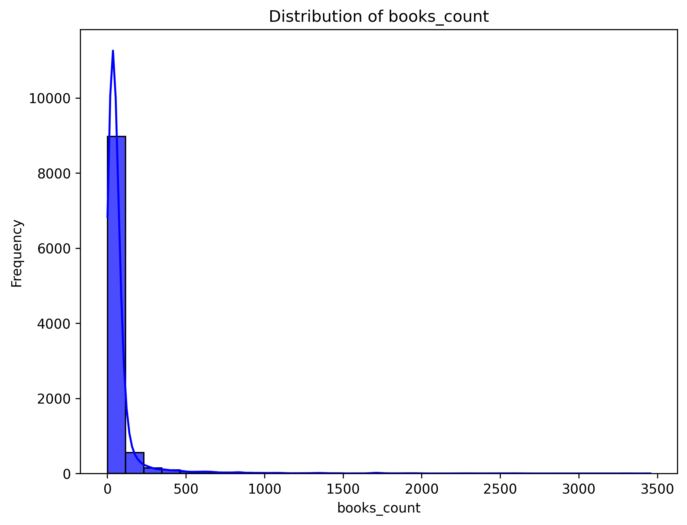
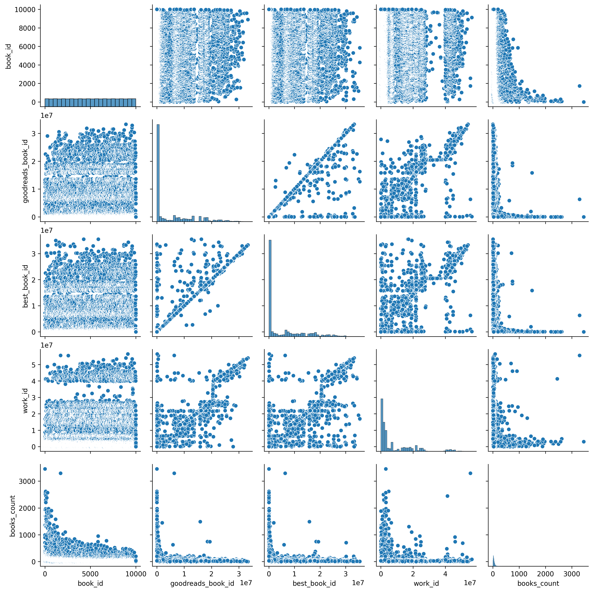

# Automated Data Analysis Report

## Dataset: goodreads.csv

### Overview
This analysis was automatically generated using the Autolysis script. Below is a summary of the dataset, analysis, and insights.

### Dataset Information
- **Columns**: 23
- **Rows**: N/A
- **Column Data Types**:
- book_id: int64
- goodreads_book_id: int64
- best_book_id: int64
- work_id: int64
- books_count: int64
- isbn: object
- isbn13: float64
- authors: object
- original_publication_year: float64
- original_title: object
- title: object
- language_code: object
- average_rating: float64
- ratings_count: int64
- work_ratings_count: int64
- work_text_reviews_count: int64
- ratings_1: int64
- ratings_2: int64
- ratings_3: int64
- ratings_4: int64
- ratings_5: int64
- image_url: object
- small_image_url: object

### Key Findings
#### Summary Statistics
| index                     |   count |   unique | top                                                                                      |   freq |            mean |              std |            min |             25% |              50% |             75% |              max |
|:--------------------------|--------:|---------:|:-----------------------------------------------------------------------------------------|-------:|----------------:|-----------------:|---------------:|----------------:|-----------------:|----------------:|-----------------:|
| book_id                   |   10000 |      nan | nan                                                                                      |    nan |  5000.5         |   2886.9         |     1          |  2500.75        |   5000.5         |  7500.25        |  10000           |
| goodreads_book_id         |   10000 |      nan | nan                                                                                      |    nan |     5.2647e+06  |      7.57546e+06 |     1          | 46275.8         | 394966           |     9.38223e+06 |      3.32886e+07 |
| best_book_id              |   10000 |      nan | nan                                                                                      |    nan |     5.47121e+06 |      7.82733e+06 |     1          | 47911.8         | 425124           |     9.63611e+06 |      3.55342e+07 |
| work_id                   |   10000 |      nan | nan                                                                                      |    nan |     8.64618e+06 |      1.17511e+07 |    87          |     1.00884e+06 |      2.71952e+06 |     1.45177e+07 |      5.63996e+07 |
| books_count               |   10000 |      nan | nan                                                                                      |    nan |    75.7127      |    170.471       |     1          |    23           |     40           |    67           |   3455           |
| isbn                      |    9300 |     9300 | 375700455                                                                                |      1 |   nan           |    nan           |   nan          |   nan           |    nan           |   nan           |    nan           |
| isbn13                    |    9415 |      nan | nan                                                                                      |    nan |     9.75504e+12 |      4.42862e+11 |     1.9517e+08 |     9.78032e+12 |      9.78045e+12 |     9.78083e+12 |      9.79001e+12 |
| authors                   |   10000 |     4664 | Stephen King                                                                             |     60 |   nan           |    nan           |   nan          |   nan           |    nan           |   nan           |    nan           |
| original_publication_year |    9979 |      nan | nan                                                                                      |    nan |  1981.99        |    152.577       | -1750          |  1990           |   2004           |  2011           |   2017           |
| original_title            |    9415 |     9274 |                                                                                          |      5 |   nan           |    nan           |   nan          |   nan           |    nan           |   nan           |    nan           |
| title                     |   10000 |     9964 | Selected Poems                                                                           |      4 |   nan           |    nan           |   nan          |   nan           |    nan           |   nan           |    nan           |
| language_code             |    8916 |       25 | eng                                                                                      |   6341 |   nan           |    nan           |   nan          |   nan           |    nan           |   nan           |    nan           |
| average_rating            |   10000 |      nan | nan                                                                                      |    nan |     4.00219     |      0.254427    |     2.47       |     3.85        |      4.02        |     4.18        |      4.82        |
| ratings_count             |   10000 |      nan | nan                                                                                      |    nan | 54001.2         | 157370           |  2716          | 13568.8         |  21155.5         | 41053.5         |      4.78065e+06 |
| work_ratings_count        |   10000 |      nan | nan                                                                                      |    nan | 59687.3         | 167804           |  5510          | 15438.8         |  23832.5         | 45915           |      4.94236e+06 |
| work_text_reviews_count   |   10000 |      nan | nan                                                                                      |    nan |  2919.96        |   6124.38        |     3          |   694           |   1402           |  2744.25        | 155254           |
| ratings_1                 |   10000 |      nan | nan                                                                                      |    nan |  1345.04        |   6635.63        |    11          |   196           |    391           |   885           | 456191           |
| ratings_2                 |   10000 |      nan | nan                                                                                      |    nan |  3110.89        |   9717.12        |    30          |   656           |   1163           |  2353.25        | 436802           |
| ratings_3                 |   10000 |      nan | nan                                                                                      |    nan | 11475.9         |  28546.4         |   323          |  3112           |   4894           |  9287           | 793319           |
| ratings_4                 |   10000 |      nan | nan                                                                                      |    nan | 19965.7         |  51447.4         |   750          |  5405.75        |   8269.5         | 16023.5         |      1.4813e+06  |
| ratings_5                 |   10000 |      nan | nan                                                                                      |    nan | 23789.8         |  79768.9         |   754          |  5334           |   8836           | 17304.5         |      3.01154e+06 |
| image_url                 |   10000 |     6669 | https://s.gr-assets.com/assets/nophoto/book/111x148-bcc042a9c91a29c1d680899eff700a03.png |   3332 |   nan           |    nan           |   nan          |   nan           |    nan           |   nan           |    nan           |
| small_image_url           |   10000 |     6669 | https://s.gr-assets.com/assets/nophoto/book/50x75-a91bf249278a81aabab721ef782c4a74.png   |   3332 |   nan           |    nan           |   nan          |   nan           |    nan           |   nan           |    nan           |

#### Missing Values
|                           |   Missing Values |
|:--------------------------|-----------------:|
| book_id                   |                0 |
| goodreads_book_id         |                0 |
| best_book_id              |                0 |
| work_id                   |                0 |
| books_count               |                0 |
| isbn                      |              700 |
| isbn13                    |              585 |
| authors                   |                0 |
| original_publication_year |               21 |
| original_title            |              585 |
| title                     |                0 |
| language_code             |             1084 |
| average_rating            |                0 |
| ratings_count             |                0 |
| work_ratings_count        |                0 |
| work_text_reviews_count   |                0 |
| ratings_1                 |                0 |
| ratings_2                 |                0 |
| ratings_3                 |                0 |
| ratings_4                 |                0 |
| ratings_5                 |                0 |
| image_url                 |                0 |
| small_image_url           |                0 |

### Narrative
The dataset has been analyzed for its summary statistics, missing values, correlations, and PCA components. Key insights from the visualizations are highlighted in the charts provided.

### Visualizations
- Chart 1: 
- Chart 2: 
- Chart 3: 
- Chart 4: 
- Chart 5: 
- Chart 6: 
- Chart 7: 
- Chart 8: 
