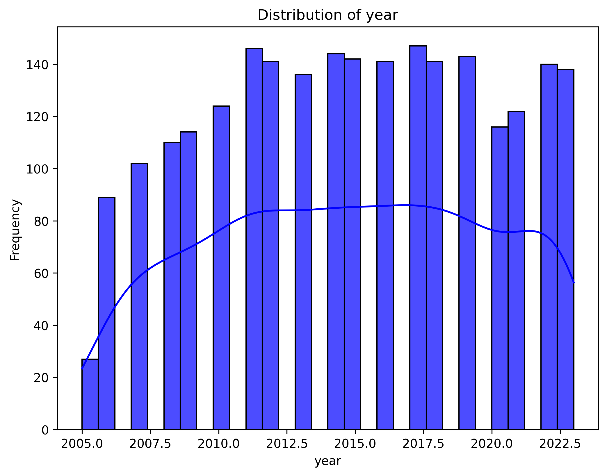

# Automated Data Analysis Report

## Dataset: happiness.csv

### Overview
This analysis was automatically generated using the Autolysis script. Below is a summary of the dataset, analysis, and insights.

### Dataset Information
- **Columns**: 11
- **Rows**: 11
- **Column Data Types**: {'Country name': 'object', 'year': 'int64', 'Life Ladder': 'float64', 'Log GDP per capita': 'float64', 'Social support': 'float64', 'Healthy life expectancy at birth': 'float64', 'Freedom to make life choices': 'float64', 'Generosity': 'float64', 'Perceptions of corruption': 'float64', 'Positive affect': 'float64', 'Negative affect': 'float64'}

### Key Findings
- **Summary Statistics**:
       Country name         year  Life Ladder  Log GDP per capita  Social support  Healthy life expectancy at birth  Freedom to make life choices   Generosity  Perceptions of corruption  Positive affect  Negative affect
count          2363  2363.000000  2363.000000         2335.000000     2350.000000                       2300.000000                   2327.000000  2282.000000                2238.000000      2339.000000      2347.000000
unique          165          NaN          NaN                 NaN             NaN                               NaN                           NaN          NaN                        NaN              NaN              NaN
top       Argentina          NaN          NaN                 NaN             NaN                               NaN                           NaN          NaN                        NaN              NaN              NaN
freq             18          NaN          NaN                 NaN             NaN                               NaN                           NaN          NaN                        NaN              NaN              NaN
mean            NaN  2014.763860     5.483566            9.399671        0.809369                         63.401828                      0.750282     0.000098                   0.743971         0.651882         0.273151
std             NaN     5.059436     1.125522            1.152069        0.121212                          6.842644                      0.139357     0.161388                   0.184865         0.106240         0.087131
min             NaN  2005.000000     1.281000            5.527000        0.228000                          6.720000                      0.228000    -0.340000                   0.035000         0.179000         0.083000
25%             NaN  2011.000000     4.647000            8.506500        0.744000                         59.195000                      0.661000    -0.112000                   0.687000         0.572000         0.209000
50%             NaN  2015.000000     5.449000            9.503000        0.834500                         65.100000                      0.771000    -0.022000                   0.798500         0.663000         0.262000
75%             NaN  2019.000000     6.323500           10.392500        0.904000                         68.552500                      0.862000     0.093750                   0.867750         0.737000         0.326000
max             NaN  2023.000000     8.019000           11.676000        0.987000                         74.600000                      0.985000     0.700000                   0.983000         0.884000         0.705000

- **Missing Values**:
Country name                          0
year                                  0
Life Ladder                           0
Log GDP per capita                   28
Social support                       13
Healthy life expectancy at birth     63
Freedom to make life choices         36
Generosity                           81
Perceptions of corruption           125
Positive affect                      24
Negative affect                      16

### Narrative

### Visualizations
- 
- 
- 
- 
- 
- 
- 
- 
