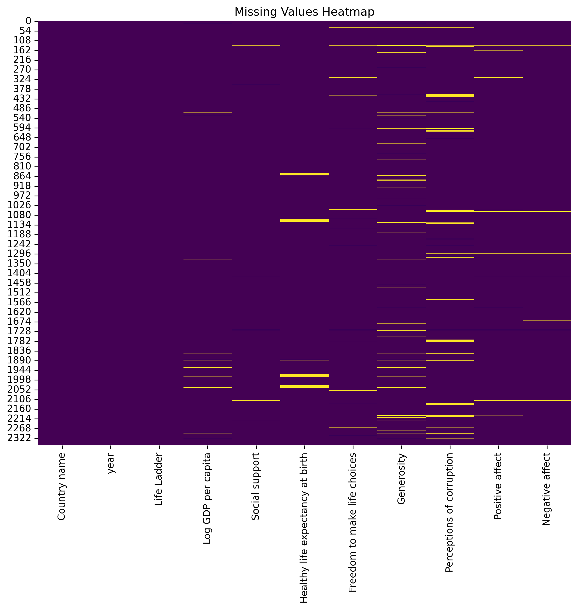

# Automated Data Analysis Report

## Dataset: happiness.csv

### Overview
This analysis was automatically generated using the Autolysis script. Below is a summary of the dataset, analysis, and insights.

### Dataset Information
- **Columns**: 11
- **Rows**: N/A
- **Column Data Types**:
- Country name: object
- year: int64
- Life Ladder: float64
- Log GDP per capita: float64
- Social support: float64
- Healthy life expectancy at birth: float64
- Freedom to make life choices: float64
- Generosity: float64
- Perceptions of corruption: float64
- Positive affect: float64
- Negative affect: float64

### Key Findings
#### Summary Statistics
| index                            |   count |   unique | top       |   freq |           mean |         std |      min |       25% |       50% |        75% |      max |
|:---------------------------------|--------:|---------:|:----------|-------:|---------------:|------------:|---------:|----------:|----------:|-----------:|---------:|
| Country name                     |    2363 |      165 | Argentina |     18 |  nan           | nan         |  nan     |  nan      |  nan      |  nan       |  nan     |
| year                             |    2363 |      nan | nan       |    nan | 2014.76        |   5.05944   | 2005     | 2011      | 2015      | 2019       | 2023     |
| Life Ladder                      |    2363 |      nan | nan       |    nan |    5.48357     |   1.12552   |    1.281 |    4.647  |    5.449  |    6.3235  |    8.019 |
| Log GDP per capita               |    2335 |      nan | nan       |    nan |    9.39967     |   1.15207   |    5.527 |    8.5065 |    9.503  |   10.3925  |   11.676 |
| Social support                   |    2350 |      nan | nan       |    nan |    0.809369    |   0.121212  |    0.228 |    0.744  |    0.8345 |    0.904   |    0.987 |
| Healthy life expectancy at birth |    2300 |      nan | nan       |    nan |   63.4018      |   6.84264   |    6.72  |   59.195  |   65.1    |   68.5525  |   74.6   |
| Freedom to make life choices     |    2327 |      nan | nan       |    nan |    0.750282    |   0.139357  |    0.228 |    0.661  |    0.771  |    0.862   |    0.985 |
| Generosity                       |    2282 |      nan | nan       |    nan |    9.77213e-05 |   0.161388  |   -0.34  |   -0.112  |   -0.022  |    0.09375 |    0.7   |
| Perceptions of corruption        |    2238 |      nan | nan       |    nan |    0.743971    |   0.184865  |    0.035 |    0.687  |    0.7985 |    0.86775 |    0.983 |
| Positive affect                  |    2339 |      nan | nan       |    nan |    0.651882    |   0.10624   |    0.179 |    0.572  |    0.663  |    0.737   |    0.884 |
| Negative affect                  |    2347 |      nan | nan       |    nan |    0.273151    |   0.0871311 |    0.083 |    0.209  |    0.262  |    0.326   |    0.705 |

#### Missing Values
|                                  |   Missing Values |
|:---------------------------------|-----------------:|
| Country name                     |                0 |
| year                             |                0 |
| Life Ladder                      |                0 |
| Log GDP per capita               |               28 |
| Social support                   |               13 |
| Healthy life expectancy at birth |               63 |
| Freedom to make life choices     |               36 |
| Generosity                       |               81 |
| Perceptions of corruption        |              125 |
| Positive affect                  |               24 |
| Negative affect                  |               16 |

### Narrative
The dataset has been analyzed for its summary statistics, missing values, correlations, and PCA components. Key insights from the visualizations are highlighted in the charts provided.

### Visualizations
- Chart 1: 
- Chart 2: 
- Chart 3: 
- Chart 4: 
- Chart 5: 
- Chart 6: 
- Chart 7: 
- Chart 8: 
