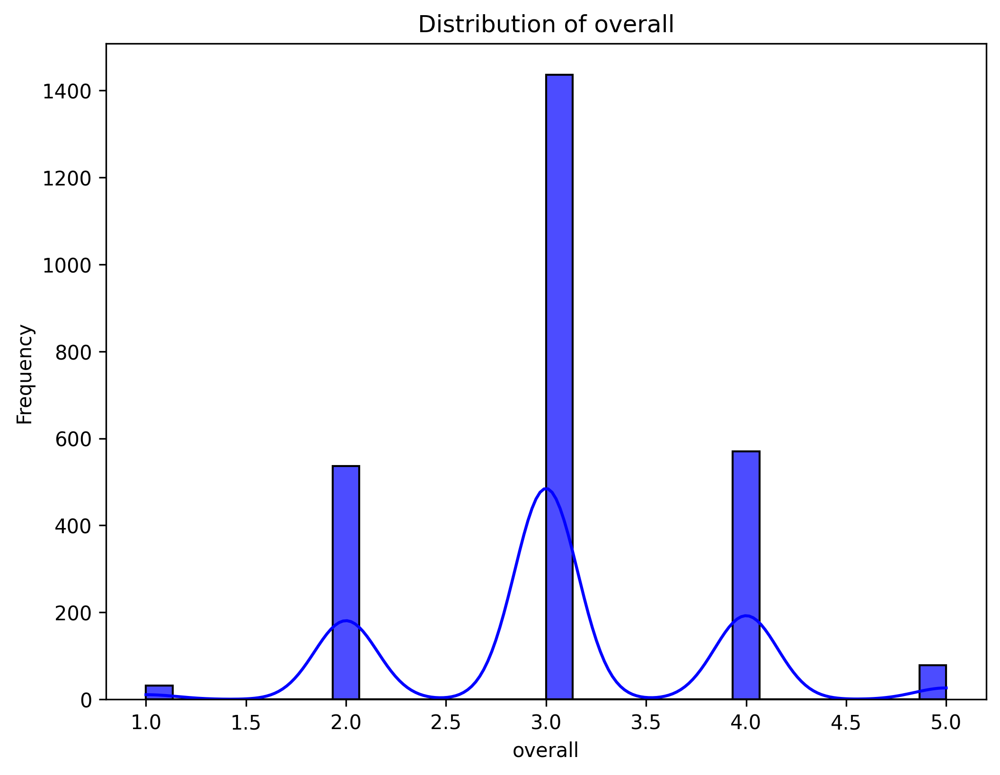

# Automated Data Analysis Report

## Dataset: media.csv

### Overview
This analysis was automatically generated using the Autolysis script. Below is a summary of the dataset, analysis, and insights.

### Dataset Information
- **Columns**: 8
- **Rows**: 8
- **Column Data Types**: {'date': 'object', 'language': 'object', 'type': 'object', 'title': 'object', 'by': 'object', 'overall': 'int64', 'quality': 'int64', 'repeatability': 'int64'}

### Key Findings
- **Summary Statistics**:
             date language   type              title                 by      overall      quality  repeatability
count        2553     2652   2652               2652               2390  2652.000000  2652.000000    2652.000000
unique       2055       11      8               2312               1528          NaN          NaN            NaN
top     21-May-06  English  movie  Kanda Naal Mudhal  Kiefer Sutherland          NaN          NaN            NaN
freq            8     1306   2211                  9                 48          NaN          NaN            NaN
mean          NaN      NaN    NaN                NaN                NaN     3.047511     3.209276       1.494721
std           NaN      NaN    NaN                NaN                NaN     0.762180     0.796743       0.598289
min           NaN      NaN    NaN                NaN                NaN     1.000000     1.000000       1.000000
25%           NaN      NaN    NaN                NaN                NaN     3.000000     3.000000       1.000000
50%           NaN      NaN    NaN                NaN                NaN     3.000000     3.000000       1.000000
75%           NaN      NaN    NaN                NaN                NaN     3.000000     4.000000       2.000000
max           NaN      NaN    NaN                NaN                NaN     5.000000     5.000000       3.000000

- **Missing Values**:
date              99
language           0
type               0
title              0
by               262
overall            0
quality            0
repeatability      0

### Narrative

### Visualizations
- 
- 
- 
- 
- 
- 
